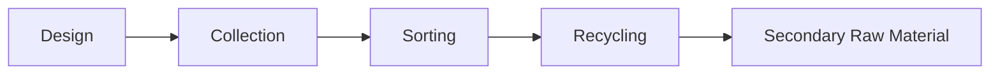
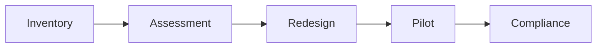

# EU Packaging and Packaging Waste Regulation (PPWR)

## 2025 Compliance Guide

### Consultant Edition

Prepared by: Your Company

---

# Agenda

1. Background
2. EU Green Deal & PPWR
3. Timeline
4. Scope
5. Core Requirements
6. Design for Recycling
7. Recycled Content
8. Reuse & Refill
9. Labelling
10. Digital Product Information
11. Business Impact
12. Taiwan Exporters
13. Action Plan
14. Q&A

---

# EU Green Deal

PPWR is one of the key regulations supporting the European Green Deal.

| Regulation | Focus |
|---|---|
| ESPR | Sustainable Products |
| PPWR | Packaging |
| CSRD | Sustainability Reporting |
| CBAM | Carbon |
| EUDR | Deforestation |

---

# Why PPWR?

- Reduce packaging waste
- Increase recyclability
- Promote reuse
- Increase recycled plastic content
- Harmonize the EU market

---

# Timeline

```text
2022 Proposal
   ↓
2024 Adoption
   ↓
2025 Entry into force
   ↓
2030 Major obligations
   ↓
2040 Future targets
```

---

# Scope

- Consumer packaging
- Transport packaging
- Industrial packaging
- E-commerce packaging
- Food packaging

---

# Core Requirements

| Requirement | Status |
|---|---|
| Packaging minimization | Mandatory |
| Design for Recycling | Mandatory |
| Recycled content | Mandatory |
| Labelling | Mandatory |
| Documentation | Mandatory |

---

# Design for Recycling



- Prefer mono-material
- Easy separation
- Compatible labels and adhesives

---

# Packaging Minimization

Reduce:

- Weight
- Volume
- Empty space

---

# Recycled Plastic Content

Illustrative overview:

| Category | 2030 | 2040 |
|---|---:|---:|
| PET | 30% | 50% |
| Contact-sensitive | 10% | 25% |
| Other plastics | 35% | 65% |

---

# Reuse & Refill

Priority sectors:

- Beverage
- Transport packaging
- Commercial packaging

---

# Labelling

Future labels may include:

- Material ID
- Sorting instructions
- QR Code
- Digital information

---

# Business Impact

Affected teams:

- R&D
- Procurement
- Packaging Engineering
- Quality
- Sustainability
- Regulatory Affairs

---

# Taiwan Exporters

Recommended actions:

- Review packaging portfolio
- Verify recyclability
- Engage suppliers
- Prepare technical documentation

---

# Compliance Roadmap



---

# Key Takeaways

- PPWR is transforming packaging design.
- Early preparation reduces compliance risk.
- Circular economy creates new business opportunities.

---

# References

- Regulation (EU) 2025/40
- European Green Deal
- Circular Economy Action Plan

---

# Thank You

## Questions?
